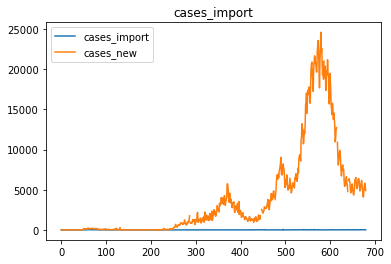

# COVID-19 New_Cases_Prediction_in_Malaysia
### Time-series data (Deep Learning)
The absence of AI assisted automated tracking and predicting system is the cause of the wide spread of COVID-19 pandemic. Therefore the usage of deep learning to predict the daily COVID cases to determine if travel bans should be imposed or rescinded.

## ABOUT THE PROJECT
The project is about predicting the number of emerging COVID-19 new cases daily basis. Hence, we need to create a deep learning model using LSTM neural network to predict the new cases in Malaysia using the past 30 days of number of cases.

## OBJECTIVE
1. Implement LSTM, Dense and Dropout layers in the model.
2. Nodes in the LSTM layers should be ≤ 64.
3. Window size should be set to 30 days.
4. MAPE error should be lesser than 1% when tested against testing dataset.
5. Training loss should be displayed using TensorBoard.

## REQUIREMENTS
1. OS Module
3. pickle
5. Datetime
6. NumPy
7. Matplotlib
8. pandas
9. scikit-learn
10. TensorFlow

## PROJECT OVERVIEW
#### EDA (EXPLORATORY DATA ANALYSIS)
##### STEP 1) DATA LOADING
- Read the data using pandas by downloading the dataset through the link: [MoH-Malaysia](https://github.com/MoH-Malaysia/covid19-public)
- Also make a backup for the dataset using .copy()
##### STEP 2) DATA INSPECTION
- After observing the dataset generally, we might assume that Date column might be considered to be removed as it is unnecessary.
- Besides, there is presence of many missing values in dataset.
- Noted that, target column (cases_new) has missing values
- There are several rows in target column that cannot be detected as missing values. Therefore, we will making a list of missing value types/characters in order to  force the IDE to read and detect the presence of missing values.
- Now, instead of 7 columns have missing values, there are 8 columns inspected to have missing values. The columns that have NaNs are:
    ```
    1) cases_new --> 12
    2) all cluster columns --> 342
    ```
- Then, checking the duplicates. Fortunately, there are no duplicates in the dataset.
- Next, plot the graph of each columns by comparing them against the target columns, cases_new. Every columns in the dataset are continuous data. The graphs are as follows:




- cases_adult imitate the graph of cases_new. The early hypothesis is, we might say cases_adult contribute the most for the arising of cases_new.
- The number of unvaccinated (cases_invax) is the highest at late 500 days.
- Then, followed by partial vaccinated at late 500 days and lastly, the number of fully vaccinated going up and a little bit higher than partial vaccinated later at early 600 days.
- This might be due to increase number of vaccination provided by government and public alertness against the danger of COVID.
- As we can see, the emerging of new cases arise steeply when unvaccinated cases at the highest peak and then it takes an effect by going down after the number of fully vaccinated increases.
- Nevertheless, the number of recovered were on par with the emerging of new cases.

##### STEP 3) DATA CLEANING
- Things to be filtered:
         ```
         1) Remove date column (unnecessary)
         2) Handle missing values (interpolate - cases_new)
         ```
     
- By the way, since we only want to predict cases_new only, therefore, we deal with cases_new only, hence, we will handle data cleaning just for cases_new. 
- Otherwise, the rest will be unuseful. So, for cases_new has missing values, we will interpolate tha data to handle the missing values for cases_new. 
- Then, the rest, we will left them as they are.

##### STEP 4) FEATURE SELECTION
- We are now selecting only cases_new data.

##### STEP 5) DATA PREPROCESSING
- We will be using MinMaxScaler to ensure the data within the range 0-1. The reason is because we want to preserve the shape of the original distribution.
- Things that we did in this step are:

        1) Scalling the target data
        2) Set the window size to 30.

#### MODEL DEVELOPMENT
- For model development, we build deep learning model using Sequential Approach by implementing LTSM, Dense and Dropout layers.
- Below is the model summary:


- Developed model architecture:


#### MODEL TRAINING
- Model was trained using 16 batch_size and 100 epochs.
- Result of model training:


- Training process plotted using TensorBoard:


- Based on the result of the model training, MAPE readings are very bad but MSE reading seems quite stable. The MAPE show the reading fluctuates a lot. This can be observed on the TensorBoard.

#### MODEL EVALUATION
- Graph being plotted using matplotlib for history keys (mape,loss)


- We can see, mape graphs fluctuates a lot as its readings. Meanwhile, loss seems stable.

#### MODEL DEPLOYMENT AND ANALYSIS
- We imported another test dataset to be concatenated with the training dataset.
- Then, we have to do data analysis again like duplicates and missing values to make sure the data is clean and able to produce good model.
- For missing values inside cases_new, we handles using Interpolation as it is time-series data.
- After concatenated both training and test dataset, we made a prediction using model we trained before.
- Then, compare the predicted cases against the actual cases.
- The graphs have to measurements. Scaled graph show values that we scalled before using MinMaxScaler. Meanwhile, Inversed graph is the actual measurements based on the recorded dataset.


#### MODEL PERFORMANCE
- We evaluate the model performance using Mean Squared Error, Mean Absolute Error and Mean Absolute Percentage Error.
- The results are as follows:


#### DISCUSSION/REPORTING
- The model is able to predict the trend of the covid new cases.
- Meanwhile the mean absolute percentage error successfully achieved 0.16% which is below 1% when tested against testing dataset.
- Therefore, there is still a room for improvement. For example, we may # implement the usage of bidirectional LTSM, use clustering to improve the the accuracy of our model and other appropriate methods.

## CREDIT
The dataset obtain from: [MoH-Malaysia](https://github.com/MoH-Malaysia/covid19-public)

